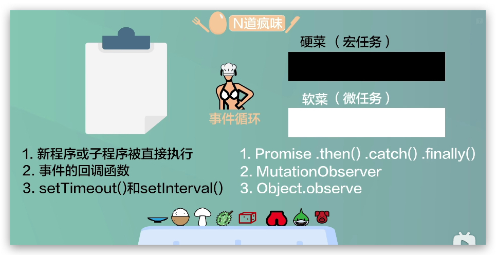
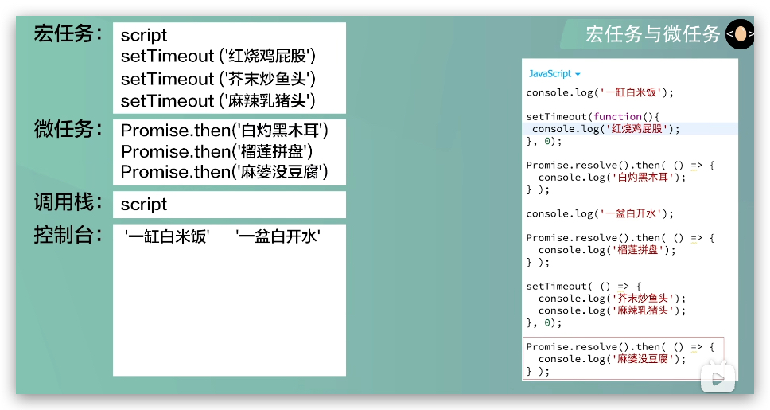

## 1.什么是 JavaScript 事件循环（Event Loop）？宏任务和微任务执行顺序是怎样的？

Event Loop事件循环是一个不断进行循环的机制，事件循环会不断去寻找可以执行的任务来执行，在执行完同步任务之后，也就是清空了 **调用栈** 之后，首先会执行微任务 **队列** 中的任务，把微任务 **队列** 的任务清空之后才会去执行宏任务。



常见的宏任务有：
1.新程序或子程序被直接执行
2.事件的回调函数
3.setTimeout()和setInterval()

常见的微任务有：
1.Promise.then()或.catch()或.finally()
2.MutationObserver
3.Object.observe()

总结流程：
首先执行宏任务，script标签中的整体同步代码，在事件循环中被视为一个宏任务单元来执行，执行完同步代码之后，需要看一下需不需要渲染页面，如果需要渲染页面，那么渲染页面，渲染完页面之后，会先清空微任务队列，然后执行宏任务队列中的任务。

宏任务 -> 微任务 - > 渲染 - > 宏任务 - > 微任务 - > 渲染 - > ...



示例代码：
```javascript
    console.log('一缸白米饭');

    setTimeout(() => {
       console.log('红烧鸡屁股'); 
    },0);

    Promise.resolve().then(() => {
       console.log('白灼黑木耳');
    })

    console.log('一盆白开水');

    Promise.resolve().then(() => {
       console.log('榴莲拼盘')
    });

    setTimeout(() => {
        console.log('芥末抄鱼头');
        console.log('麻辣乳猪头');
    }, 0);

    Promise.resolve().then(() => {
        console.log('麻婆没豆腐');
    })

```
## 2.Promise 的状态有哪些？状态如何变化？

Promise有三种状态：pending（进行中）、fulfilled（已成功）和rejected（已失败）。

状态转换：

```plain
pending → fulfilled
pending → rejected
```

特点：

1. **状态一旦改变不可逆**
2. 只能从 pending 改变一次
3. fulfilled / rejected 都属于 **settled**

Promise就像怀孕不是马上就能知道结果的，是需要一定时间才知道的，所以promise其实是回调的升级版，在处理一些需要比较长时间的任务时，使用promise就能进行异步的处理，防止阻塞。

```javascript
const isPregnant = true;
const promise = new Promise((resolve, reject) => {
    if (isPregnant) {
        resolve("孩子他爹");
    } else {
        reject("老公");
    }
})
promise
    .then( res => {
        console.log(`男人成为了${res}`);
    })
    .catch( res => {
        console.error(`男生成为了${res}`);
    })
    .finally(() => {
        console.log(`男人和女人最终结婚了！`);
    })
```

## 3.async / await 和 Promise 的关系是什么？

本质：async / await 是 Promise 的语法糖；

async函数永远返回一个promise对象，如果返回的不是promise对象，会自动包装成promise对象。

async函数实际返回的是Promise.resolve()的结果。

await等待的是一个Promise对象，返回的是Promise对象的结果，await等价于promise.then()，await必须写在async函数中。

## 4.JavaScript有哪些数据类型？

JavaScript 数据类型（共 8 种）

一、原始类型（7 种）
1. number     数字（整数、浮点数）
2. string     字符串
3. boolean    布尔值（true / false）
4. null       空值
5. undefined  未定义
6. symbol     唯一值
7. bigint     大整数

二、引用类型（1 种）
object
常见结构包括：Object、Array、Function、Date、Map、Set

三、存储区别
原始类型：存储在栈内存中（存值）
引用类型：栈内存存引用（地址），堆内存存实际数据


## 5.如何判断数据类型？（typeof / instanceof / Object.prototype.toString）他们之间的区别

typeof：
作用：检测数据类型
返回：小写字母字符串
操作数：简单数据类型、函数或者对象
操作数数量：一个

```javascript
    console.log(typeof 123); // number
    console.log(typeof '123'); // string
```

instanceof：
作用：检测对象之间的关联性
返回：布尔值
操作数：左边必须是应用类型，右边必须是函数
操作数数量：两个

```javascript
    console.log([] instanceof Array); // true
    console.log({} instanceof Array); // false
```

Object.prototype.toString.call()：
作用：检测数据类型
返回：大写字母字符串
操作数：简单数据类型、函数或者对象
操作数数量：一个
```javascript
    console.log(Object.prototype.toString.call([])); // [object Array]
    console.log(Object.prototype.toString.call({})); // [object Object]
```

## 6.原型对象是什么？原型链是什么？JavaScript 的继承是如何实现的？

每当新对象被创建时，除了各自的属性以外，还有一个隐式的属性__proto__属性被创建，这个属性会指向各自的原型对象。而原型对象也会有自己的__proto__属性，最终会指向object（object就是老祖宗）。这个链条就叫做原型链。

JavaScript的继承是通过原型链来实现的，原型链的顶端是Object.prototype，Object.prototype的__proto__属性指向null。

继承实现方式：
常见：1. 原型链继承；2. 构造函数继承；3. 组合继承；4. 寄生组合继承；5. class继承

## 7.什么是闭包？闭包的作用是什么？

执行上下文（执行环境）：决定代码的作用域，相当于为代码划清界线。包括：全局环境，函数环境。

简单说：函数可以访问外部函数的变量

闭包：函数执行时产生的环境，这个环境可以访问外部函数的变量，并且这个环境不会随着函数的执行完毕而销毁。

闭包的作用：
1. 实现数据私有化
2. 实现函数柯里化
3. 实现模块化


## var、let、const的区别


